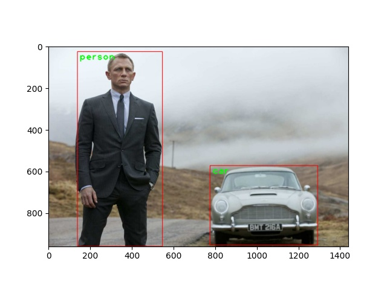

# Python image classification
Comming soon!!! There are three simple ideas - 



1. The first idea is to build a simple neural network to recognize floating numbers less than .5 and label them as 0, and 1 otherwise. The input range is from 0 to 1.

2. The second idea is to use pretrained deep learning algorithms such as mobilenetV2 and modify the neural network to train more data to predict some specific outcome. 

3. The third idea is to demonstrate object detection from an image and a video.

Tensorflow is a popular deep learning framework by Google. Keras is a wrapper around the Tensorflow (and other frameworks) to make it easy for programmers to work with deep learning framworks such as Tensoflow.

OpenCV is an open source package/library, which is aimed at real time computer vision.

## Prerequisites

``` 
pip install -r requirements.txt 
python round_operation_neural_network.py 
```

You can use Jupyter notebook to run the code. In that case, download anaconda https://www.anaconda.com/products/individual and install the above libraries and launch Jupyter notebook.

## Key concepts
Artificial Intellegence (AI): Enables machines to take decision.

Machine Learning (ML): It is a subset of AI which helps us to explore data. There are three types of ML - 
   1. Supervised - We provide past labeled data where the output is known.
   2. Unsupervised - We don't have labeled data therefore the output is not known (Clustering types of problems).
   3. Reinforcement (Semi supervised) - Some part of data are labeled. 

Deep Learning (DL): It is a subset of ML. The idea is to mimic machine to learn like human. It uses Multi Neural Network architecture. There are mainly three  techniques - 
   1. ANN (Artificial Neural Network) - Numbers based data is usually solved by ANN.
   2. CNN (Convulsion Neural network) - Images based data is usually solved by CNN. There is also a techinque called Transfer Learning, where we use a already trained deep learning network and train more data to reach a specific outcome on top of what is already learned. For example, if we have a trained model that can detect Cats then we can use the trained model and train the model with more data to be able to recognize whether a cat is male or female.
   3. RNN (Recurrent Neural Network) - Time series based data is usually solved with RNN.

Data Science (DS): Data Science inludes data gathering (data acquisition), data preparation (cleaning), data exploration and then data modeling.

